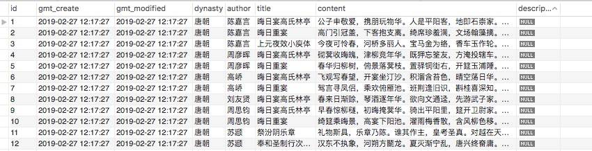

# tangPoetry
一个开源的唐诗数据库,收录了30多万唐诗(tang poetry:A open source poetry of the tang dynasty)

全库只有一张表：poetry。

下载地址：http://down.51cto.com/data/2459317

使用过程：

1  新建数据库  CREATE SCHEMA `tang-poetry` ;

2  在MySQLWorkbench中的Management中选择Data Import/Restore 或者常规的sql导入: mysql -uroot -p1234 tang-poetry  <poetry.sql (改成自己的用户名和密码)

3  最后效果：

